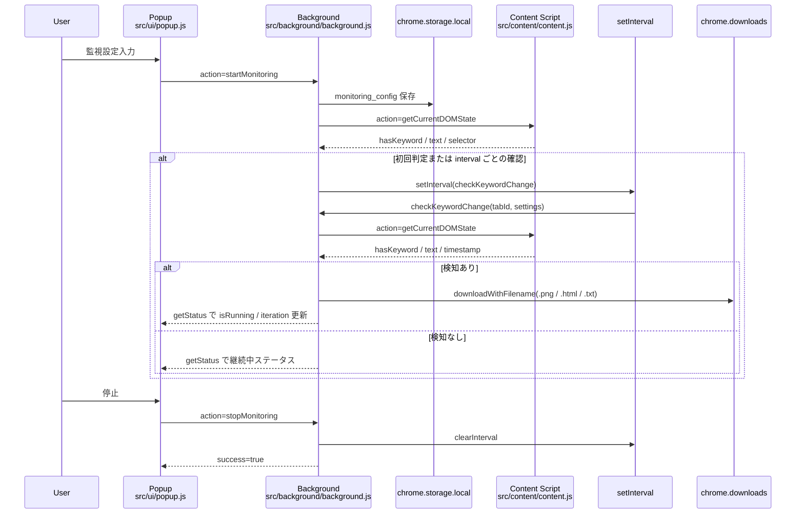

# キーワード監視フロー

系統Aの単一監視で、`popup.js` の `startMonitoring` から開始し、`content.js` の `getCurrentDOMState` で DOM を確認する流れです。

```mermaid
sequenceDiagram
  participant U as User
  participant P as Popup<br/>src/ui/popup.js
  participant B as Background<br/>src/background/background.js
  participant S as chrome.storage.local
  participant C as Content Script<br/>src/content/content.js
  participant I as setInterval
  participant D as chrome.downloads

  U->>P: 監視設定入力
  P->>B: action=startMonitoring
  B->>S: monitoring_config 保存
  B->>C: action=getCurrentDOMState
  C-->>B: hasKeyword / text / selector

  alt 初回判定または interval ごとの確認
    B->>I: setInterval(checkKeywordChange)
    I->>B: checkKeywordChange(tabId, settings)
    B->>C: action=getCurrentDOMState
    C-->>B: hasKeyword / text / timestamp

    alt 検知あり
      B->>D: downloadWithFilename(.png / .html / .txt)
      B-->>P: getStatus で isRunning / iteration 更新
    else 検知なし
      B-->>P: getStatus で継続中ステータス
    end
  end

  U->>P: 停止
  P->>B: action=stopMonitoring
  B->>I: clearInterval
  B-->>P: success=true
```
