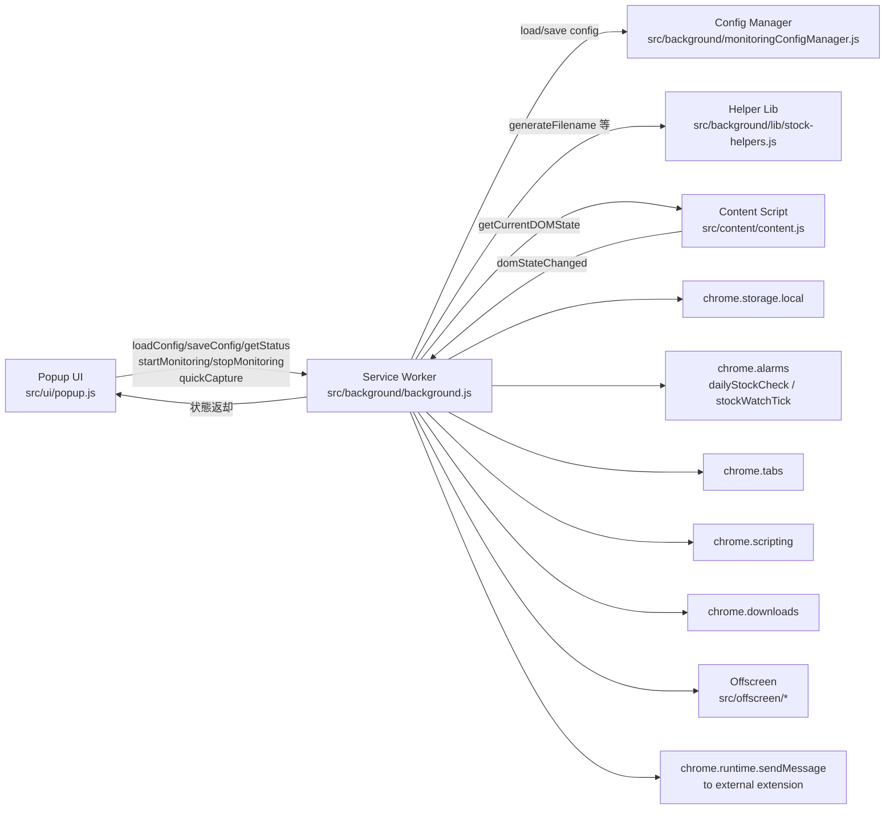

# コンポーネント図

`PageRecorder` の主要コンポーネントと責務境界を表します。
実ファイル・実 API 名に寄せてあります。

```mermaid
flowchart LR
  Popup["Popup UI<br/>src/ui/popup.js"]

  Background["Service Worker<br/>src/background/background.js"]

  Content["Content Script<br/>src/content/content.js"]

  Config["Config Manager<br/>src/background/monitoringConfigManager.js"]
  Helpers["Helper Lib<br/>src/background/lib/stock-helpers.js"]
  Offscreen["Offscreen<br/>src/offscreen/*"]

  Storage["chrome.storage.local"]
  Alarms["chrome.alarms<br/>dailyStockCheck / stockWatchTick"]
  Tabs["chrome.tabs"]
  Scripting["chrome.scripting"]
  Downloads["chrome.downloads"]
  External["chrome.runtime.sendMessage<br/>to external extension"]

  Popup -->|loadConfig/saveConfig/getStatus<br/>startMonitoring/stopMonitoring<br/>quickCapture| Background
  Background -->|状態返却| Popup

  Background -->|load/save config| Config
  Background -->|generateFilename 等| Helpers

  Background -->|getCurrentDOMState| Content
  Content -->|domStateChanged| Background

  Background --> Storage
  Background --> Alarms
  Background --> Tabs
  Background --> Scripting
  Background --> Downloads
  Background --> Offscreen
  Background --> External
```
