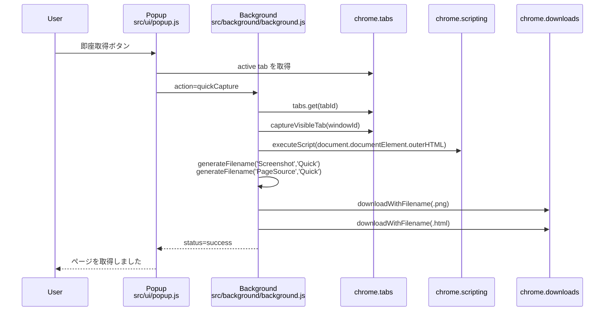

# 即座取得フロー

`popup.js` の `quickCapture` から、現在のタブのスクリーンショットと HTML を保存する流れです。

```mermaid
sequenceDiagram
  participant U as User
  participant P as Popup<br/>src/ui/popup.js
  participant B as Background<br/>src/background/background.js
  participant T as chrome.tabs
  participant X as chrome.scripting
  participant D as chrome.downloads

  U->>P: 即座取得ボタン
  P->>T: active tab を取得
  P->>B: action=quickCapture
  B->>T: tabs.get(tabId)
  B->>T: captureVisibleTab(windowId)
  B->>X: executeScript(document.documentElement.outerHTML)
  B->>B: generateFilename('Screenshot','Quick')<br/>generateFilename('PageSource','Quick')
  B->>D: downloadWithFilename(.png)
  B->>D: downloadWithFilename(.html)
  B-->>P: status=success
  P-->>U: ページを取得しました
```
