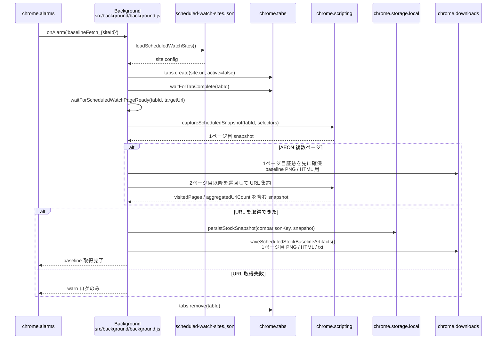

# 定時 baseline 取得フロー

`scheduled-watch-sites.json` の `baselineTime` に基づき、`baselineFetch_*` アラームで baseline を保存する流れです。

```mermaid
sequenceDiagram
  participant A as chrome.alarms
  participant B as Background<br/>src/background/background.js
  participant J as scheduled-watch-sites.json
  participant T as chrome.tabs
  participant X as chrome.scripting
  participant S as chrome.storage.local
  participant D as chrome.downloads

  A->>B: onAlarm('baselineFetch_{siteId}')
  B->>J: loadScheduledWatchSites()
  J-->>B: site config
  B->>T: tabs.create(site.url, active=false)
  B->>T: waitForTabComplete(tabId)
  B->>B: waitForScheduledWatchPageReady(tabId, targetUrl)
  B->>X: captureScheduledSnapshot(tabId, selectors)
  X-->>B: 1ページ目 snapshot

  alt AEON 複数ページ
    B->>D: 1ページ目証跡を先に確保<br/>baseline PNG / HTML 用
    B->>X: 2ページ目以降を巡回して URL 集約
    X-->>B: visitedPages / aggregatedUrlCount を含む snapshot
  end

  alt URL を取得できた
    B->>S: persistStockSnapshot(comparisonKey, snapshot)
    B->>D: saveScheduledStockBaselineArtifacts()<br/>1ページ目 PNG / HTML / txt
    B-->>A: baseline 取得完了
  else URL 取得失敗
    B-->>A: warn ログのみ
  end

  B->>T: tabs.remove(tabId)
```
