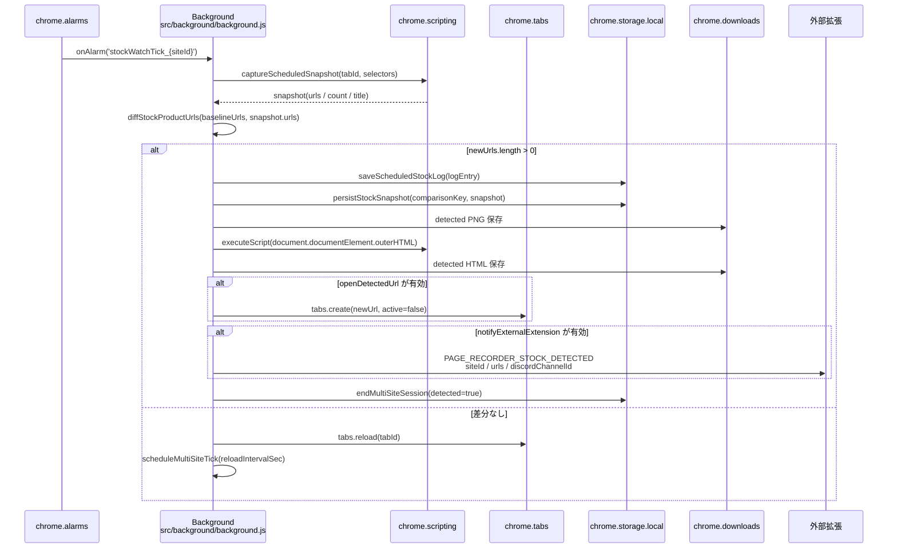

# 定時検知と通知フロー

定時在庫監視の `stockWatchTick` 実行中に差分が見つかった後、証跡保存と外部通知を行う流れです。

```mermaid
sequenceDiagram
  participant A as chrome.alarms
  participant B as Background<br/>src/background/background.js
  participant X as chrome.scripting
  participant T as chrome.tabs
  participant S as chrome.storage.local
  participant D as chrome.downloads
  participant E as 外部拡張

  A->>B: onAlarm('stockWatchTick_{siteId}')
  B->>X: captureScheduledSnapshot(tabId, selectors)
  X-->>B: snapshot(urls / count / title)
  B->>B: diffStockProductUrls(baselineUrls, snapshot.urls)

  alt newUrls.length > 0
    B->>S: saveScheduledStockLog(logEntry)
    B->>S: persistStockSnapshot(comparisonKey, snapshot)
    B->>D: detected PNG 保存
    B->>X: executeScript(document.documentElement.outerHTML)
    B->>D: detected HTML 保存

    alt openDetectedUrl が有効
      B->>T: tabs.create(newUrl, active=false)
    end

    alt notifyExternalExtension が有効
      B->>E: PAGE_RECORDER_STOCK_DETECTED<br/>siteId / urls / discordChannelId
    end

    B->>S: endMultiSiteSession(detected=true)
  else 差分なし
    B->>T: tabs.reload(tabId)
    B->>B: scheduleMultiSiteTick(reloadIntervalSec)
  end
```
