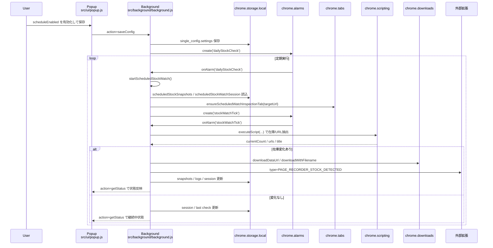

# 定時在庫監視フロー

系統B/C の定時在庫監視で、`dailyStockCheck` / `stockWatchTick` を起点に在庫確認し、変化があれば保存と外部通知を行う流れです。

```mermaid
sequenceDiagram
  participant U as User
  participant P as Popup<br/>src/ui/popup.js
  participant B as Background<br/>src/background/background.js
  participant S as chrome.storage.local
  participant A as chrome.alarms
  participant T as chrome.tabs
  participant X as chrome.scripting
  participant D as chrome.downloads
  participant E as 外部拡張

  U->>P: scheduleEnabled を有効化して保存
  P->>B: action=saveConfig
  B->>S: single_config.settings 保存
  B->>A: create('dailyStockCheck')

  loop 定期実行
    A->>B: onAlarm('dailyStockCheck')
    B->>B: startScheduledStockWatch()
    B->>S: scheduledStockSnapshots / scheduledStockWatchSession 読込
    B->>T: ensureScheduledWatchInspectionTab(targetUrl)
    B->>A: create('stockWatchTick')

    A->>B: onAlarm('stockWatchTick')
    B->>X: executeScript(...) で在庫/URL抽出
    X-->>B: currentCount / urls / title

    alt 在庫変化あり
      B->>D: downloadDataUrl / downloadWithFilename
      B->>E: type=PAGE_RECORDER_STOCK_DETECTED
      B->>S: snapshots / logs / session 更新
      B-->>P: action=getStatus で状態反映
    else 変化なし
      B->>S: session / last check 更新
      B-->>P: action=getStatus で継続中状態
    end
  end
```
