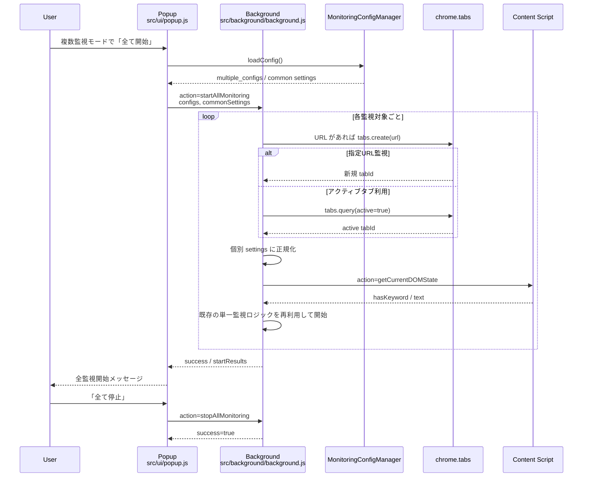

# 複数監視フロー

複数監視モードで `popup.js` の `startAllMonitoring` を起点に、各監視対象を順次開始する流れです。

```mermaid
sequenceDiagram
  participant U as User
  participant P as Popup<br/>src/ui/popup.js
  participant B as Background<br/>src/background/background.js
  participant M as MonitoringConfigManager
  participant T as chrome.tabs
  participant C as Content Script

  U->>P: 複数監視モードで「全て開始」
  P->>M: loadConfig()
  M-->>P: multiple_configs / common settings
  P->>B: action=startAllMonitoring<br/>configs, commonSettings

  loop 各監視対象ごと
    B->>T: URL があれば tabs.create(url)
    alt 指定URL監視
      T-->>B: 新規 tabId
    else アクティブタブ利用
      B->>T: tabs.query(active=true)
      T-->>B: active tabId
    end

    B->>B: 個別 settings に正規化
    B->>C: action=getCurrentDOMState
    C-->>B: hasKeyword / text
    B->>B: 既存の単一監視ロジックを再利用して開始
  end

  B-->>P: success / startResults
  P-->>U: 全監視開始メッセージ

  U->>P: 「全て停止」
  P->>B: action=stopAllMonitoring
  B-->>P: success=true
```
